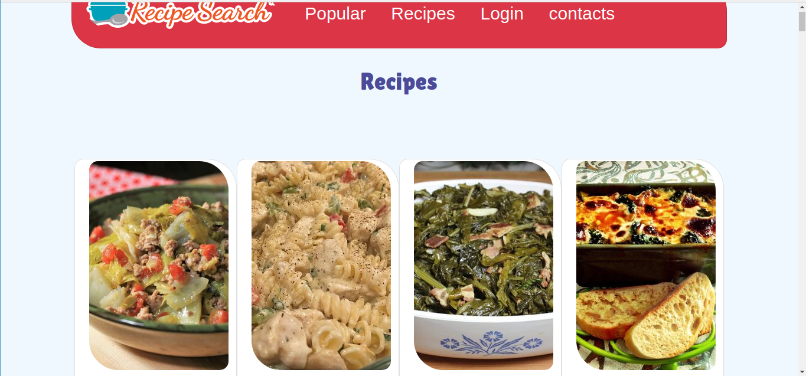

# RECIPE-WEBSITE

<https://loisa-kitakaya.github.io/recipe-website>

## Authors

- LOISA KITAKAYA
- MARGARET IRUNGU
- ANDREW AMBIA
- WINNIE MWIKALI

## Description

This is a website that details recipes for those curious about culinary arts.By clicking on the images it provides the user with the different recipes for different dishes.You can also subscribe to our website ata the contacts page by filling in the details required.

#### SET UP INSTRUCTIONS

- You need to have a good network connection.
- You need to have a github account so that you can deploy the project and get a live link.
- You can click the link below for the live site on github

#### BUGS ENCOUNTERED

- The login page refuses to load because having php running on gh-pages is a challenge since github only allows static pages and php is not a static page.

#### ISSUES

- For any Issues encountered you can post them
  <a href="https://github.com/Loisa-Kitakaya/recipe-website/issues">here.</a>

##### TECHNOLOGIES USED

- HTML
- CSS
- bootstrap
- javascript
- jQuery
- php

##### BDD

- By clicking on the images it provides the user with the different recipes for different dishes.You can also subscribe to our website ata the contacts page by filling in the details required.
  

###### SUPPORT & COLLABORATION

- To anyone who would like to add a feature to th site, kindly clone the site and further contact us on the permission to merge your changes.

###### CONTACTS info

- Email :loisakitakaya@gmail.com
- Email :sairzmargaret44@gmail.com
- Email :andrew.ambia@gmail.com
- Email :mwikaliwinnie303@gmail.com

###### LICENSE info

- - Licensed under the [MIT license](LICENSE).
